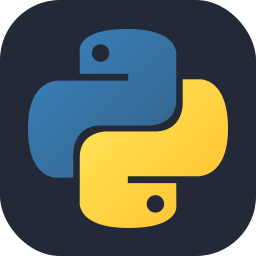
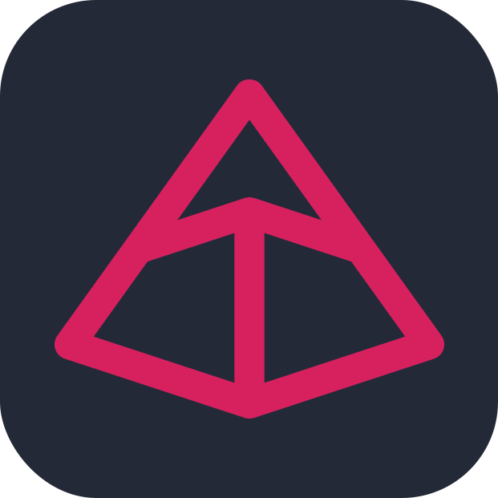

 
  

## 🧑‍💻 About Me
- **🐍 Python Backend engineer** with over 3 years of experience in software development, including some full-stack projects.
- **⚙️ Specialize** in building efficient, scalable server-side applications with working knowledge of frontend technologies. 
- **📚 Actively expanding** my skills in both backend and frontend development to become a **Full Stack Developer**.
- **🚀 Committed** to continuous learning to stay ahead in an ever-evolving tech landscape.

## 📂 My Top Projects
<section>
  
  
           
  
  
    
</section>

    
## 📊 Stats & Activity
<section>
  
  &nbsp;&nbsp;&nbsp;&nbsp;&nbsp;
  
             
  
    
</section>

## 🔧 Technologies & Tools That I Use
### Languages
<section>
  
  &nbsp;&nbsp;&nbsp;&nbsp;
  
  &nbsp;&nbsp;&nbsp;&nbsp;
  
    
  
</section>

### Frameworks
<section>
  
  &nbsp;&nbsp;&nbsp;&nbsp;
  
  &nbsp;&nbsp;&nbsp;&nbsp;
  
    
  
</section>

### Tools & Libraries
<section>
  
  &nbsp;&nbsp;&nbsp;&nbsp;
  
  &nbsp;&nbsp;&nbsp;&nbsp;
  
    
  
  &nbsp;&nbsp;&nbsp;&nbsp;
  
  &nbsp;&nbsp;&nbsp;&nbsp;
  
    
  
  &nbsp;&nbsp;&nbsp;&nbsp;
  
</section>

### Databases
<section>
  
  &nbsp;&nbsp;&nbsp;&nbsp;
  
</section>

### CI/CD
<section>
  
</section>

### Server & Deployment
<section>
  
  &nbsp;&nbsp;&nbsp;&nbsp;
  
  &nbsp;&nbsp;&nbsp;&nbsp;
  
</section>

### IDE
<section>
  
  &nbsp;&nbsp;&nbsp;&nbsp;
  
    
</section>

## 📬 Contact Me
<section align="center">
   
  
  &nbsp;&nbsp;&nbsp;&nbsp;&nbsp;&nbsp;&nbsp;&nbsp;&nbsp;&nbsp;&nbsp;
  
    
</section>
